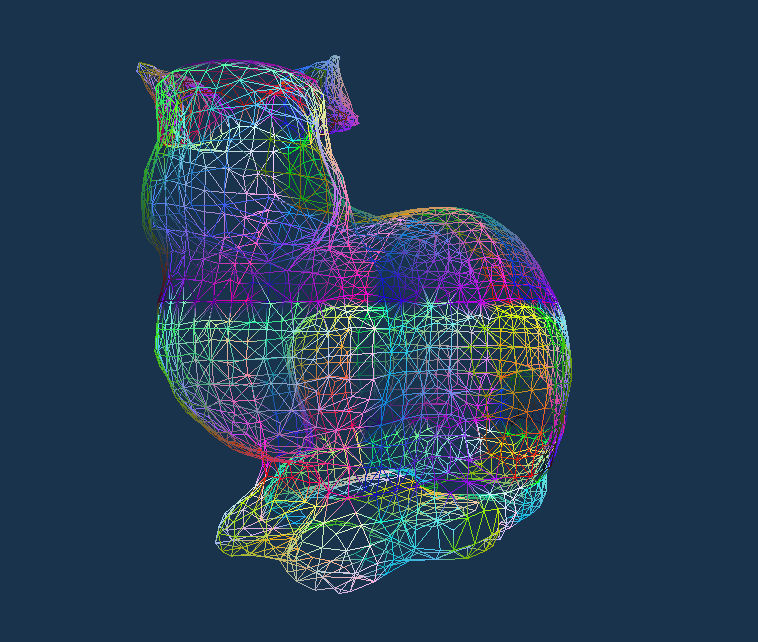

# Wireframe and Thick-Line Rendering in WebGPU

Demo: https://potree.org/permanent/wireframe_rendering/ (requires Chrome 96)

Render a single indexed triangle model as mesh, wireframe, or wireframe with thick lines, 
without the need to generate additional buffers for line rendering.

Uses <a href="https://xeolabs.com/pdfs/OpenGLInsights.pdf">vertex pulling</a> to let the vertex shader 
decide which vertices to load, which allows us to render indexed triangle meshes as wireframes or even thick-wireframes.

<ul>
	<li>A normal wireframe is obtained by drawing 3 lines (6 vertices) per triangle. 
		The vertex shader then uses the index buffer to load the triangle vertices in the order in which we need them to draw lines.
		 
		<a href="https://github.com/m-schuetz/webgpu_wireframe_thicklines/blob/master/renderWireframe.js">[code]</a>
	</li>
	<li>
		A thick wireframe is obtained by rendering each of the 3 lines of a triangle as a quad (comprising 2 triangles).
		For each triangle of the indexed model, we are drawing a total of 3 lines/quads = 6 triangles = 18 vertices.
		Each of these 18 vertices belongs to one of three lines, 
		and each vertex shader invocation loads the start and end of the corresponding line. The line is then projected to 
		screen space, and the orthoginal of the screen-space line direction is used to shift the vertices of each quad into the appropriate directions 
		to obtain a thick line.
		 
		<a href="https://github.com/m-schuetz/webgpu_wireframe_thicklines/blob/master/renderWireframeThick.js">[code]</a>
	</li>
</ul>

<table>
	<tr>
	<td></td>
	<td></td>
	</tr>
</table>

